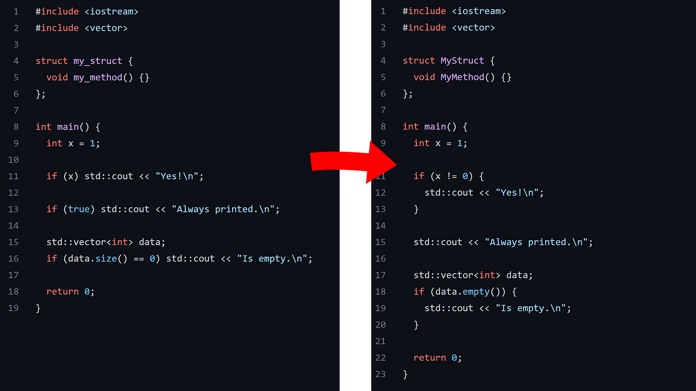

  

## A Grueling Task
Imagine staring at an incomprehensible mess of code, trying to figure out exactly what it does and how it works but to no avail. This is often the reality for many students and developers alike, attempting to read others' code and make sense of it all. "Why did they use let instead of const? This variable never changes" or "Why did they use var instead of let? This variable's scope is limited to this tiny block right here" are some of the questions you or someone you know may have asked themselves at some point in time. Meanwhile, you think to yourself "If only there was a way to standardize all of this so things make sense". Well, there is! Enter the world of coding standards.

## Standardization: Beauty Exists In The Small Things
Coding standards are essentially a set of guidelines and rules that an organization sets in order to ensure the entire codebase being contributed to by multiple developers is coherent to every member of the team. Sure, for smaller projects like those found in academic programs, this may not be that large of an issue. The problem exists when there is a multi-million line codebase that has been painstakingly worked on by tens if not hundreds of developers over its lifetime. Standards are not simply limited to rules like the above mentioned, they also include things such as the restriction of certain library functions that have proven to be unsafe compared to other functions. One such example is the usage of scanf() to accept user input in C, which is widely known to not account for buffer overflows. At least, not without the use of a max width specifier. Even so, the standard move is to use fgets() and sscanf() instead for a few reasons. Namely, a separation of concern and the ability to handle buffer overflows more gracefully as fgets() is used to read n-characters of input into a buffer and sscanf() is then used to parse that input. It's little things like these that can make a world of difference when it comes to debugging by other developers and maintaining the codebase if everyone is on the same page.

## Caveats
Now of course, these standards must be enforced and it's hard to do so from a human-perspective. Everyone has biases and it's hard to catch every single mistake made. This is where static analysis tools such as ESLint come into play. With this tool, I am constantly reminded of the various rules defined by the ES6 standard as my screen is flooded with a ridiculously disgusting number of red squiggly lines. I don't necessarily agree with every rule, as I do believe the use of curly brackets on their own separate lines looks cleaner and easier to read than placing them next to the function definition or the loop condition. However, as stated I do agree with the standardization of code and this is just the ruleset I need to adhere to while I code in Javascript. It's an ultimately small price to pay for the betterment of the team, since it is no longer just about me. It's about making things easier for the team, at large.