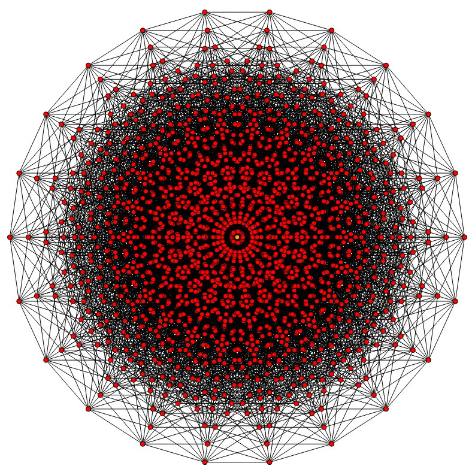

  

## Design Patterns: The Head Chefs of Software Engineering
In the ever-bustling realm of software engineering, countless lines of code dance together in a symphony of logic and structure. However, as the complexity of these systems grows, so too does the need for a more organized approach to development. This is where design patterns join the fray. Design patterns are a set of reusable solutions to common problems that pop up in the software engineering process. The bottom line is that they attempt to provide a blueprint for structuring code in a way that is both efficient and maintainable, depending on the project's needs. In brief, they can essentially play the role of head chef in the kitchen of software engineering in a sense, guiding the development process towards a satisfying conclusion by providing a concrete frame for software applications.

## Model-View-Controller: The Backbone of Web Development
The Model-View-Controller pattern has long since been the traditionally agreed upon pattern used for structuring web applications. The largest benefit to using it is perhaps the separation of concerns so commonly harped upon in many software circles it provides. First, we have the Model: the ever so silent but capable busy bee working behind the scenes to handle the data and logic of our beloved applications. Essentially, this is where your basic CRUD (Create, Read, Update, Delete) functionality is handled. Next up, we have the View: one could call this the mascot or the face of the application, the one who "sells the dream" in a manner of speaking. This is what the end user ultimately interacts with. Last but not least, there is the mediator, the Controller: the one who acts as the middleman, gently introducing the Model to the View and facilitating communication between them. I've been unknowingly using this pattern for quite some time now in various classes, most recently in my Software Engineering course. Our final project consists of separating these three components into their own respective files and directories, which has made the project a great deal more manageable. It's a pattern that I've personally come to appreciate and will likely continue to use in the future, supposing I don't find something better for whatever my use cases end up being.

## Singleton: The One and Only
The Singleton is much like the One Ring in Lord of The Rings: there can only be one. This pattern is used when you want to ensure a class really only has one instance and it's meant to be globally accessible. Much like any shared resource, you wouldn't want multiple instances of it available as that could cause issues and confusion down the line. Once again, we have somewhat applied this conceptually in our final project, as we have what is effectively a Singleton instance of our Clubs collection. While it would be possible to create multiple instances of the Clubs collection and there's nothing really restricting us, there would be no point. I am hoping to use this pattern more in the future as I can see the potential benefits of doing so.