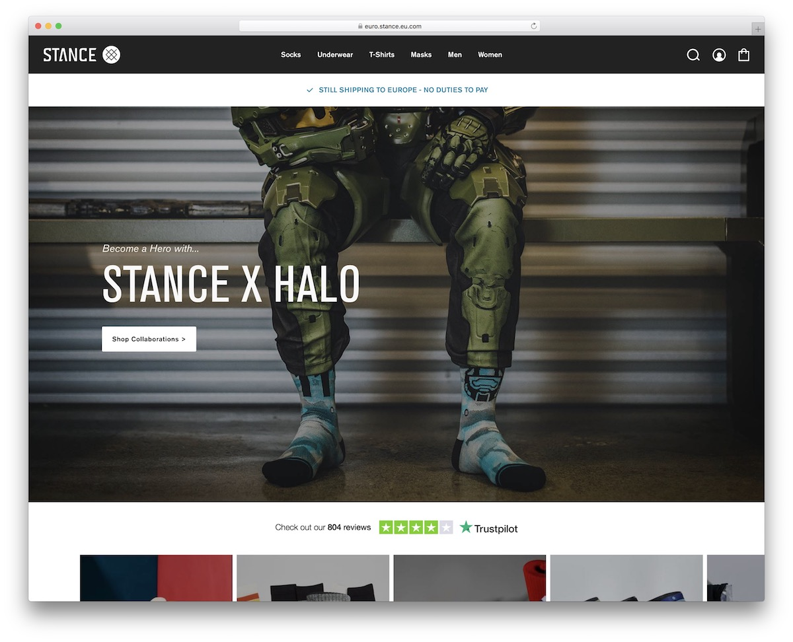

  

## The Struggle
The pain of designing a site with raw HTML and CSS is something I hope to never experience again. Don't get me wrong, they're fine and provide the foundations for creating some beautiful sites but the amount of time it takes to create a site from pure scratch is simply not worth the trouble in the eyes of this neophyte. The countless hours spent trying to get the layout of everything just right, the tiniest adjustments to padding and margins, the struggle to make sure everything is somewhat responsive and doesn't look like a complete mess is absolutely grueling. A flexbox here, a justify-content-center there, and everything somehow breaks. However, my woes are luckily no more thanks to the blessed introduction of UI frameworks.

## Bootstrap 5: A Light In The Darkness
Bootstrap 5 is a UI framework that massively simplifies the site design process. No longer must I trudge through creating new rows and columns of varying sizes manually for every single element I want to add to my site. No longer must I concern myself with creating custom containers for everything when I have access to Bootstrap's grid framework. Buttons? Bootstrap has those too. The list goes on and on, and I can honestly say that my web development life has become much easier as a result of this creation.

## A Boon to Software Engineering
The use of frameworks such as Bootstrap 5 is a godsend for anyone who involved in the software engineering process as it saves an exponential amount of time for frontend development. This is time saved that could be better spent on other aspects of the project, such as backend development or unit testing. I sincerely believe it is a win-win for practically everyone involved. For the frontend developer, time is saved and they can work together with the backend developer to better integrate the two halves. The QA testing team also has more time to test the site and ensure it is up to par per requirements and security standards. The project manager can breathe a massive sigh of relief as the project is more likely to be on or ahead of schedule. Outside of certain circumstances, it truly is a win-win situation for everyone involved.

