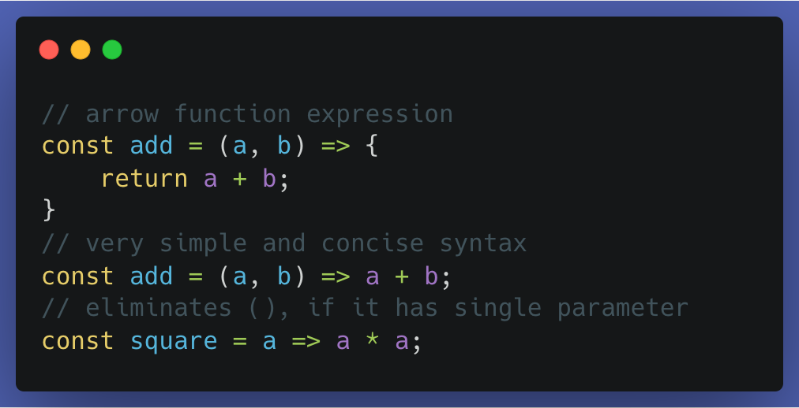

  

## Blast From The Past
When I first encountered Javascript, I thought "No way am I ever coming back to this in my life, I'll learn it once and never touch this again". Well, as I write this, I'm currently facepalming at my overconfidence. Here I am again, staring down the language I initially dismissed and opted to care so little for in the not-so-distant past. However, now it feels as though something has actually changed. I find myself enjoying using this language and its versatile features to solve problems, even though debugging is still and likely always will be, a colossal headache with this language due to the many possible runtime errors one can encounter along the way. Still, there are features that are admittedly fun to make extensive use of.

## Fun With Arrows and Other Things!
Arrow functions, are possibly one of my favorite features introduced in the ES6 standard for Javascript. Their conciseness, relatively simple and straightforward usage is so much more appealing than the traditional way of writing functions. I've enjoyed them so much so, that I cannot help but try and use them in other languages until it strikes me that they don't exist in those languages at all. Thankfully, there exist other features I can thoroughly enjoy and play around with to take my mind off this rather sad fact. One such feature is the humble callback function, an extremely powerful but slightly difficult to grasp concept for those new to Javascript and its many nuances. Essentially allowing us to perform multiple tasks in an asynchronous manner, it allows the rest of our code to continue running instead of stopping to wait for a previous instruction to complete execution. That is absolutely mindblowing and useful to me, especially if we're doing something like retrieving data and having to handle it somehow. Another feature I would be hard-pressed to live without, would be Objects. Javascript objects are much like dynamic maps, allowing us to add and remove properties, even freezing the object entirely to prevent any sort of modification to its properties whatsoever. Coming from languages like C, this is an immense timesaver as I no longer have to think about solutions involving pointers when looking for duplicates in some string of numbers or some other tedious problem involving duplicate symbols or even input validation. Simply being able to iterate over characters, throw them into an object and check if they're already there or not is a great alternative.

## Athletic Software Engineering: Painful But Useful
Currently, in a class I'm taking geared towards Software Engineering, there is a pedagogical method employed called "Athletic Software Engineering". It draws directly from Crossfit and their WODs with the only difference being the workout is largely mental and sedentary rather than physical and locomotive. Nevertheless, I find it can be rather daunting but ultimately doable based on the limited experiences I have had with it so far. A large part of the game is not psyching yourself out or letting the external environment bulldoze past your neurons trying so hard to fire and come up with a workable solution in time. Calming yourself enough to think through a problem rationally and decisively is easier said than done though, and I think that really shows when actually attempting the WODs. Yet, I think it has value in its own way since it forces you to get better under pressure which is relevant to various aspects of life in general. 
