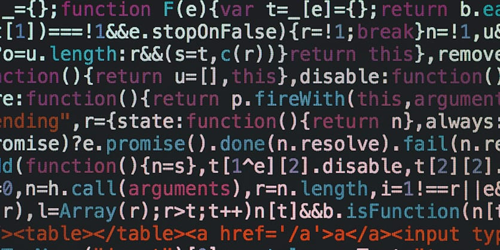

  

## The Human Element
Software Engineering, a phrase that evokes imagery of a bunch of people just huddled together, banging out lines of code like some well-oiled automaton. I confess that I myself had thought of it in this way in the distant past, before I had any exposure to it in real life. The truth is, while there is most certainly coding involved in the process, there exists an often overlooked aspect of software engineering: the human element. The need to collaborate and communicate with a group of both like-minded and unalike-minded individuals is never more apparent than when a big project needs to be executed and everyone must be on the same page for things to flow smoothly.

## Appreciation
Nevertheless, coding is an important part of the software engineering process despite only being part of a much larger process. The process of coding has certainly helped me develop a deeper sense of appreciation for the work that goes into developing an application, albeit being small in scale. I'm sure that as time goes on, I will develop an even deeper appreciation for the amount of work necessary as I endeavour to co-develop larger projects over time. It's likely most of these projects will be in the realm of cybersecurity as that is where my interests currently lie.

## My Future Is A World of Bits N' Bytes
Specifically, I have an interest in reverse engineering malware which will require me to become deeply familiar with how code is written, tested and deployed. If I cannot think like a software developer or engineer, then I cannot know what some programmer was thinking when they wrote some abstract, obfuscated piece of code that I just tried to disassemble and figure out. Granted, I'll also need to learn various tools like Ghidra and learn some form of Assembly but the main thing would be knowing the development cycle and how developers think, overall. To that end, I hope to learn more about software engineering and explore what it has to offer.

