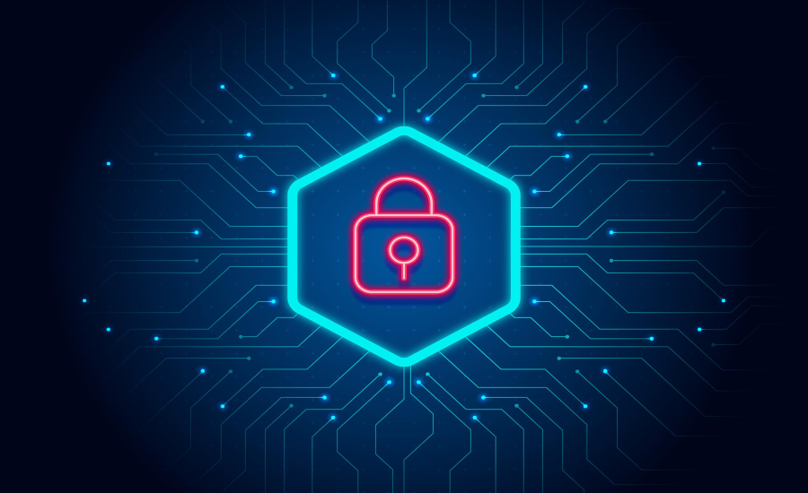

  

## Uncharted Territory
In 2023 I joined a student club tailored towards learning various aspects of cybersecurity, The Grey Hats. Having had very little in the way of experience, only having spun up a few VMs and trying to learn a bit of Linux on my own time, I wasn't completely sure how things were going to play out but I gave it a shot. Deciding to throw myself head-first into the fray, I applied to compete in the Collegiate Cyber Defense Competition for the year 2024. As the weekly training meetings continued and we started breaking up into groups and formulating our plan of attack, I would quickly realize how much of a trial by fire this process would ultimately be.

## Preparation
At first, training would consist of gathering together and going over some set of exercises in order to gain hands-on experience with some system administration tasks. Among these would be attempting to get SSH running and securing the service by manipulating the configuration file, trying to setup fail2ban, and getting some practice with some fundamental commandline utilities. Once the team was officially determined and we split off into smaller groups, it was now up to us as a team to organize tasks and keep each other updated on what we were currently up to from week to week. Unfortunately, things did not exactly go as planned as almost everyone got caught up in personal affairs and obligations. This experience further reinforced for me just how incredibly important communication and effective teamwork truly is. Regardless, I set out to perform the necessary research and do the tasks I volunteered for and luckily ended up learning quite a bit along the way.

## A Wealth of Knowledge
While we haven't actually competed yet, I feel as though I've learned a decent deal about the use of various tools and knowledge fundamental to how Computer Networking works. Among these are TCPDump and Wireshark for packet capture and analysis, respectively. The rabbit hole that is Active Directory is fairly interesting and not to mention very useful when administering a sleu of Windows boxes as one likely would in an enterprise environment. Personally, my favorite part of this process is a toss-up between figuring out how to use Wireshark and learning networking concepts like how a switch learns a Layer 2 address, what it does if it encounters an address that doesn't exist in its MAC table when receiving a frame on some interface, that sort of thing. While I have only scratched the surface of what I need to know, I believe progress is progress and I find myself excited to continue on this path.
