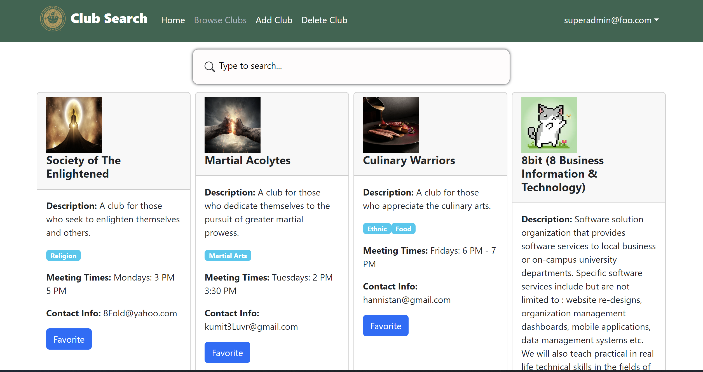

  

 For More Information Please Go Here: <a href="https://clubsearch-manoa.github.io/"> ClubSearch Manoa Homepage </a> 

 Head To Our Organization Page If You Wish To See Source Code: <a href="https://github.com/clubsearch-manoa"> ClubSearch Manoa Organization </a> 

## Overview

 ClubSearch Manoa is a web application developed in order to provide students with a central hub, one that allows them to easily browse through clubs available at UH Manoa or search for one if they have a specific club in mind. Each club displays some general information such as their meeting times, who to contact if interested in joining and a brief description of what they do. The application is built using the Meteor framework, React JS library and integrated with MongoDB for easy data storage and retrieval. Additionally, automated testing was included via Testcafe to ensure the application functions as intended. 

## Experience

 My role in this project was largely focused on the back-end side of development. I specifically dealt with making sure our data was stored and retrieved correctly in real-time from our MongoDB database. This involved creating the necessary collections and schemas to validate our data as well as setting up the necessary publications and subscriptions to actually read and serve up data from the database. Further, I was able to somewhat automate the process of adding clubs to our database by generating a JSON file containing the necessary data, then using mongoimport provided in the MongoDB CLI Tools Suite to read that file and insert all data contained within. This was a rather huge time-saver as it allowed us to populate the database in a short amount of time with less tedium relative to other methods. Doing this gave me a chance to learn more about automation in general, using tools that are already available to us rather than going through what would normally be a needlessly tedious process. 

## Finale

 Overall, I believe this project was a rather fun learning experience for me. I was able to learn more about how MongoDB works and how automated tests are written. More importantly, I gained a better understanding of how to work with a team of diverse individuals with varying skill-sets and how to better communicate with them. I believe I will walk away from this experience with fond memories of struggling through developing an application with my team and experiencing the satisfaction of seeing things ultimately come together in the end. 
