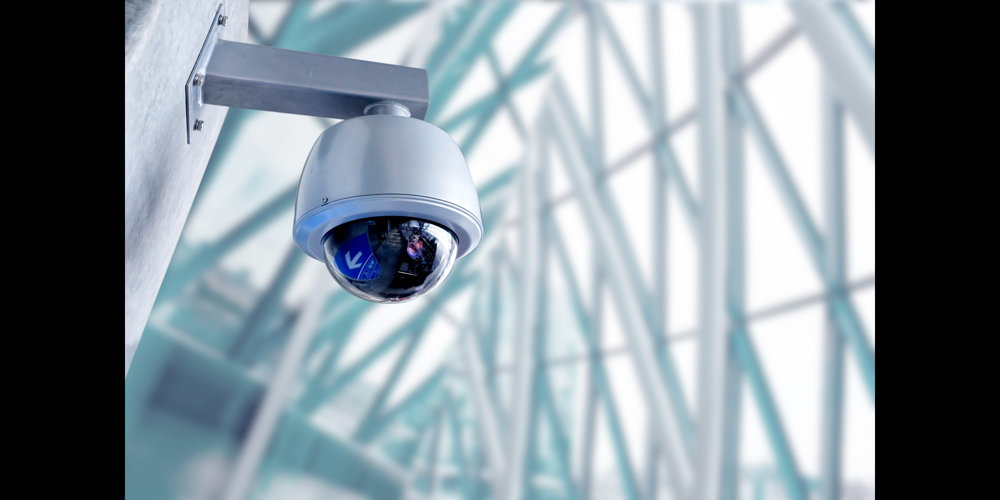

## The Calm of Night: An Unexpected Surprise
In 2016, I had the interesting experience of working as an unarmed security guard. I had no idea what to really expect as I started my first graveyard shift as a guard posted at a large historical landmark. "Just my luck" I thought, cursing my own luck as I seemed to have been assigned to a rather important site on my first week. Those thoughts would soon change to something more along the lines of "What? Is this it? Seriously?" as the nights went on and I came to the realization that being a guard was actually quite uneventful. My routine largely consisted of sitting around and doing... absolutely nothing. Well, I suppose that's not entirely true. I did have to patrol the premises every hour and watch out for the occasional group of younger teens attempting to blitz their way through the grounds on a whim or out of sheer curiosity. Though that was such a rare occurrence that it may as well not have happened at all. On average, my nights consisted of checking windows and locks for any evidence of tampering, patrolling the grounds and finding something to occupy myself with while I sat around twiddling my thumbs. However, that would change as soon as I got my next assignment.

## A Crash Course In Confrontation
I couldn't really believe where I had just been assigned to, an actual cemetery. To say I was taken aback would be the understatement of the century. Be that as it may, I still had a job to do so I spent the next couple of months accustoming myself to the creepy and quiet ambiance only a cemetary could truly afford. Granted, I had some coworkers to actually communicate and pass the time with, this time. Most nights were rather boring and uneventful as usual but one particular night, something changed. To make a long story short, I essentially had to deal with a small group of extremely intoxicated and equally beligerent seeming grave robbers armed with nothing but a flashlight.

## Teamwork Makes The Dream Work
Needless to say, I quickly realised that night that teamwork is absolutely essential in some situations. This fact is made most apparent in dangerous situations dealing with multiple people, but it still pops up in everyday life and especially in most jobs we perform. Being able to work and communicate with a set of a people efficiently will always lessen a burdensome workload, regardless of what that actually entails. After all, five heads are often better than one.
